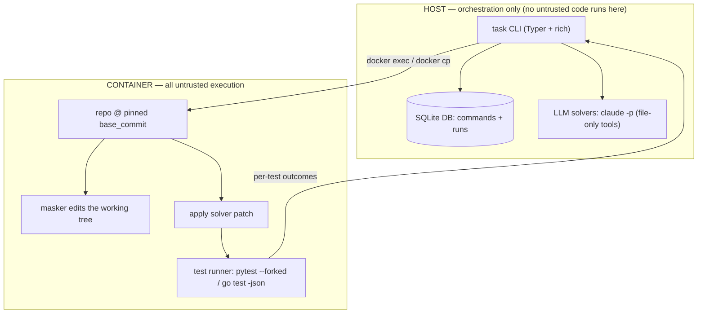
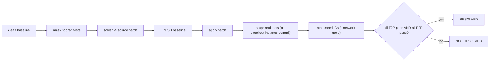
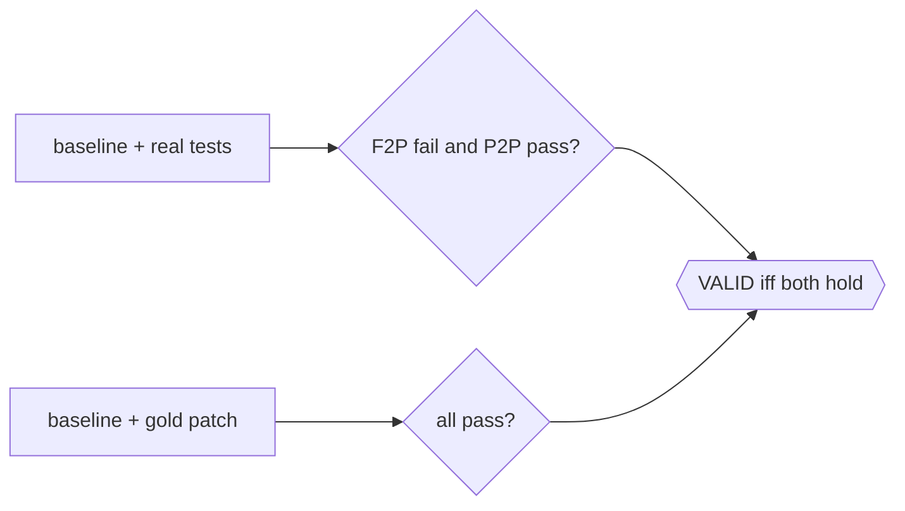

# task (taskbundle)

[](https://github.com/OWNER/REPO/actions/workflows/ci.yml)

<!-- Replace OWNER/REPO with your GitHub slug; the badge resolves once pushed. -->

A CLI that packages a SWE-bench-style coding task into a Docker container, hides the scored tests from a solver, runs a solver (stub or LLM), and scores the result — recording every run in a queryable database. Validated end-to-end on a Python (pytest) and a Go (`go test`) instance behind one runner abstraction.

## Architecture

The host only orchestrates (`docker`/`git`, the SQLite store, and — for the LLM solvers — tool-free `claude` calls). All untrusted work runs inside the container.



A `run` **solves** then **scores** against a fresh baseline, so masking can never affect the score. Scoring runs with `--network none` plus memory/CPU/PID limits.



`validate` is the bundle guardrail: it runs the scored tests on the clean baseline (expect every fail-to-pass test failing, every pass-to-pass test passing) and again after the gold patch (expect all passing) — **VALID** only if both hold.



## What it does

- **`task init`** — builds a self-contained task bundle from a SWE-Bench Pro instance (`--from-dataset`), then (given an existing bundle) starts the instance's container, discovers where the repo lives inside it, normalizes a clean baseline, verifies the toolchain builds the tests (pytest `--collect-only` / `go build`), checks the gold/test patches apply, and records the repo path + image digest into `task.json`.
- **`task validate`** — proves a bundle is well-formed by running its scored tests at baseline (expect fail-to-pass failing, pass-to-pass passing) and after the gold patch (expect all passing). Prints a per-test table and a `VALID`/`INVALID` verdict.
- **`task run`** — masks the scored tests from the solver, runs the chosen solver, applies the solver's patch to a **fresh** baseline, re-stages the real test files, runs the scored IDs, and reports `resolved = all fail-to-pass pass AND all pass-to-pass pass`. Solvers: **`noop`** / **`gold`** / **`command`** (stubs), **`anthropic`** (single-shot LLM), **`agentic`** (multi-turn LLM, file-only tools). Emits one JSON report per run.
- **`task runs` / `task log`** — query the database: list recent runs, or show the full record (and per-node results) for a run id or command id.

## Supported languages / runners

Scoring goes through a small **runner registry**; a bundle selects its runner in `task.json` (`test.runner`). Each runner stages the instance's test files and returns the same outcome map — `{test id: passed | failed | error | skipped | missing}` — and everything downstream (validate, run, the verdict) depends only on that map.

| runner | how tests run | result format |
|--------|---------------|---------------|
| `pytest` | `pytest <ids> --forked` (per-test process isolation) | JUnit XML |
| `go` | `go test -json -run '^(<names>)$' <pkg>` | JSON event stream |

Two validated example bundles ship in `bundles/`: **Ansible** (Python/pytest, full fail-to-pass + pass-to-pass guardrail) and **flipt** (Go/`go test`, 1 fail-to-pass). Adding a language is additive: implement one runner that produces the same outcome map.

## Requirements

- **Docker.** On Windows, use Docker Desktop with WSL2 integration and run everything inside the WSL/Ubuntu shell.
- **Python 3.10+** on the host (the host only orchestrates; the repo's own tests run inside the image with the image's toolchain).
- **The instance's pre-built image** (pulled in the Quickstart below).
- For the `anthropic`/`agentic` solvers: the **`claude` CLI** logged in (`claude auth login`); no API key needed.

## Install

```bash
python3 -m venv .venv && source .venv/bin/activate
pip install -e .
```

If `python3-venv` is unavailable (no interactive sudo), create the venv without pip and bootstrap it: `python3 -m venv .venv --without-pip && source .venv/bin/activate && curl -sS https://bootstrap.pypa.io/get-pip.py | python`, then `pip install -e .`.

## Quickstart

The example bundles are already included, so you can skip straight to pulling the image and running. (A bundle can be rebuilt with `task init --from-dataset <instance_id>`.)

`BUNDLE` is the included Python (Ansible) bundle:

```bash
BUNDLE=bundles/instance_ansible__ansible-cb94c0cc550df9e98f1247bc71d8c2b861c75049-v1055803c3a812189a1133297f7f5468579283f86
```

1. The bundle is already present under `bundles/` — no build step needed.
2. Pull the pre-built image:
   ```bash
   docker pull jefzda/sweap-images:ansible.ansible-ansible__ansible-cb94c0cc550df9e98f1247bc71d8c2b861c75049-v1055803c3a812189a1133297f7f5468579283f86
   ```
3. Verify the container/environment and record metadata:
   ```bash
   task init --bundle "$BUNDLE"
   ```
4. Validate the bundle (baseline vs gold) — expect **VALID**:
   ```bash
   task validate --bundle "$BUNDLE"
   ```
5. Solve with the gold patch and the function-level masker — expect **RESOLVED**:
   ```bash
   task run --bundle "$BUNDLE" --solver gold --mask function
   ```
6. Solve with the no-op solver — expect **NOT RESOLVED** (the fail-to-pass test still fails):
   ```bash
   task run --bundle "$BUNDLE" --solver noop
   ```
7. Isolation demo — a command solver that tries the network and edits a source file. Expect `NET_BLOCKED` in the report's solver meta and a captured patch containing only the source edit:
   ```bash
   task run --bundle "$BUNDLE" --solver command --mask function --solver-cmd "python -c \"import socket; socket.setdefaulttimeout(5); socket.create_connection(('1.1.1.1',53))\" 2>/dev/null && echo NET_OK || echo NET_BLOCKED; echo '# touched by solver' >> lib/ansible/release.py"
   ```
8. Real LLM solvers (these **spend Agent SDK credit** via the `claude` CLI):
   ```bash
   task run --bundle "$BUNDLE" --solver anthropic --mask function          # single-shot
   task run --bundle "$BUNDLE" --solver agentic   --mask function --model sonnet   # multi-turn
   ```
9. Query the database:
   ```bash
   task runs
   task log --id <run_id>
   ```

### Second language (Go)

The same commands work on a Go repo — only `task.json`'s runner differs. Using the included flipt bundle:

```bash
GO=bundles/instance_flipt-io__flipt-518ec324b66a07fdd95464a5e9ca5fe7681ad8f9
docker pull jefzda/sweap-images:flipt-io.flipt-flipt-io__flipt-518ec324b66a07fdd95464a5e9ca5fe7681ad8f9
task init --bundle "$GO"
task validate --bundle "$GO"      # -> VALID (TestLoad fails at baseline, passes after gold)
```

This proves the runner abstraction on a non-Python repo (the Go test runs via `go test -json`). Go instances in this dataset have 1 fail-to-pass and 0 pass-to-pass, so the Go demo exercises the fail-to-pass flip.

## Commands and flags

```
task init      --bundle PATH        Output bundle dir (with --from-dataset) or task bundle dir
               --repo TEXT           Git repo URL
               --commit TEXT         Base commit SHA
               --image TEXT          Prebuilt docker image reference
               --from-dataset TEXT   SWE-Bench Pro instance_id to scaffold a bundle from

task validate  --bundle PATH                       (required) task bundle directory
               --json PATH                          Write a machine-readable result here
               --keep-container / --rm-container     Keep/remove the container (default: --rm-container)

task run       --bundle PATH                                        (required) task bundle directory
               --solver [noop|gold|command|anthropic|agentic]        Solver backend (default: noop)
               --solver-cmd TEXT                                     Command for the 'command' solver
               --mask [file|function]                               Test-hiding strategy (default: file)
               --model TEXT                                         Model for LLM solvers (e.g. 'sonnet', 'opus')
               --out PATH                                           Write the JSON report here
               --no-network / --network                             Disable container networking (default: --no-network)
               --keep-container / --rm-container                    Keep/remove the container (default: --rm-container)

task log       --id TEXT            (required) a command_id or run_id to show
task runs      --limit INTEGER      Maximum number of runs to list (default: 20)
```

Notes: `init --from-dataset <id>` builds a bundle; `init --bundle <dir>` (without `--from-dataset`) runs the container-side verification. `--model` applies only to the `anthropic`/`agentic` solvers (agentic defaults to `sonnet`; anthropic uses the CLI's default when unset).

## Bundle format

```
<bundle>/
├── task.json                 # metadata (see below)
├── description.md            # problem statement (+ requirements/interface)
├── gold_patch.diff           # reference source fix (never touches tests)
├── test_patch.diff           # the instance's test changes
└── tests/
    ├── fail_to_pass.json      # scored ids that fail at baseline, pass after the fix
    └── pass_to_pass.json      # scored ids that pass before and after the fix
```

The scored ids are pytest node IDs (`path::Class::method`) for Python and Go test names (`TestLoad`) for Go.

`task.json` fields:

| field | meaning |
|-------|---------|
| `schema_version` | bundle schema version |
| `instance_id` | SWE-Bench Pro instance id |
| `source` | dataset origin (`swe-bench-pro`) |
| `repo` / `repo_url` | source repository |
| `base_commit` | pinned commit the task is evaluated against |
| `language` | repo language (lowercased) |
| `image` | pre-built Docker image reference |
| `image_digest` | image sha256 digest (filled by `init`; pins reproducibility) |
| `repo_path_in_container` | where the repo lives in the image (discovered by `init`) |
| `before_repo_set_cmd` | the dataset's baseline-setup commands (preserved as-is) |
| `test.runner` | `pytest` or `go` |
| `test` (pytest) | `selected_test_files` |
| `test` (go) | `scored_test_names`, `test_files`, `packages` |
| `counts.fail_to_pass` / `counts.pass_to_pass` | scored-test counts |
| `created_at` | bundle creation timestamp (ISO-8601 UTC) |

## How it works

The host only issues `docker`/`git` commands (via the CLI, no SDK) and reads results back; all untrusted work happens inside the container. A run **solves** then **scores** against a fresh baseline: it masks the scored tests, lets the solver produce a source patch, then resets to a pristine tree, applies the patch, re-stages the real tests, and runs the scored ids — so masking can never affect the score. Patch capture restores masked files first, so neither deletions nor edits leak into the recorded patch. Masking is pluggable: file-level deletes whole scored test files (language-agnostic but over-hides), while function-level uses Python's `ast` to remove only the scored functions/methods (preserving unrelated tests, with a file-level fallback). Test execution goes through a runner registry — pytest (with `--forked` per-test isolation + JUnit XML) or Go (`go test -json`) — each producing the same per-test outcome map. The run container uses `--network none` plus memory/CPU/PID limits, and the bundle pins both the base commit and the image digest. See DESIGN_NOTES.md for the tradeoffs behind these choices.

## Testing

Pure unit tests cover the tool's logic with no Docker, network, or `claude` — they run anywhere, including CI.

```bash
pip install -e ".[dev]"
pytest -q          # 31 tests
```

Covered: the AST masker transform (incl. fallbacks), the JUnit-XML and `go test -json` parsers, id flattening, the solver fence/file-block/dominant-model/path-guardrail helpers, and instance-commit derivation. GitHub Actions runs them on every push/PR across Python 3.11 and 3.12 (badge at top).

## Sample reports

Real artifacts from this tool are tracked in `examples/` (see `examples/README.md`):

- `report_gold_resolved.json` — gold patch: **RESOLVED** (all 9 scored pass).
- `report_noop_not_resolved.json` — no-op: **NOT RESOLVED** (1 fail-to-pass fails, 8 pass-to-pass pass).
- `report_command_isolation.json` + `solver_patch_command.diff` — isolation demo: `NET_BLOCKED` and a test-free captured patch.
- `report_anthropic_singleshot.json` + `solver_patch_anthropic.diff` — single-shot LLM: **8/9** (preserves all pass-to-pass, doesn't fix the fail-to-pass).
- `report_agentic.json` + `solver_patch_agentic.diff` — multi-turn LLM (Sonnet): **7/9** (found the right file but regressed a pass-to-pass).
- `go_validate_report.json` — Go (flipt) validate: **VALID** via `go test -json`.

## Limitations / future work

- **Solvers:** all five are implemented (`noop`, `gold`, `command`, single-shot `anthropic`, multi-turn `agentic`).
- **Runners:** `pytest` and `go` are implemented; the design is runner-agnostic (repo path discovered, runner declared in `task.json`), so more languages are an additive change — one new runner producing the same outcome map.
- **Masking:** function-level masking is Python-only (`ast`); other languages fall back to file-level deletion.
- **Agentic isolation:** the agent uses file-only tools (no shell) on a disposable host copy of the masked repo; running the agent itself inside a sandboxed container is documented future hardening.
- **Coverage:** validated end-to-end on one Python (Ansible) and one Go (flipt) instance.
